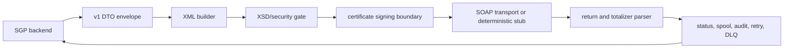

# esocial

[](https://github.com/aarusso-nyx/stynx-esocial/actions/workflows/ci.yml)
[](packages/contracts/CHANGELOG.md)
[](docs/release/1.1.0/coverage/summary.json)
[](package.json)

Standalone eSocial service bus runtime for SGP and future backend producers. It
receives typed DTO envelopes, builds eSocial XML, validates XSDs, signs through
the certificate boundary, submits through the SOAP adapter/stub, parses returns
and totalizers, and publishes status, audit, retry, DLQ, replay, and spool
events back to consumers.



## Quick Start

```bash
npm ci
npm test
npm run dev:up
npm run test:e2e
npm run dev:down
```

`npm run dev:up` starts local Postgres, LocalStack, and the deterministic SOAP
fixture host through `docker-compose.dev.yml`, then runs migrations. It never
calls real eSocial endpoints.

## Event Coverage

| Group | Active classes | Blocked |
| --- | --- | --- |
| Tables | S-1000, S-1005, S-1010, S-1020, S-1050, S-1070 | S-1030, S-1040, S-1060 |
| Periodic | S-1200, S-1202, S-1207, S-1210, S-1298, S-1299 | none |
| Worker | S-2200, S-2205, S-2206, S-2210, S-2220, S-2230, S-2240, S-2298, S-2299, S-2300, S-2306, S-2399 | none |
| Benefits/process/exclusion | S-2400, S-2405, S-2410, S-2416, S-2418, S-2420, S-2501, S-3000 | none |
| Returns | S-5001, S-5002, S-5011, S-5012, S-5013 | none |

Active coverage is 35 event/return classes. Three table classes remain
leiaute-blocked until their XSD decisions close.

## Main Commands

```bash
npm run build
npm run lint
npm test
npm run coverage
npm run test:property
npm run test:e2e
npm run bench:smoke
npm run test:db
npm run test:integration
npm run integration:localstack
npm run cdk:synth:qualification
npm run sbom -- --format=cyclonedx --out docs/release/1.1.0/sbom/contracts.cdx.json
```

## Key Docs

| Audience | Start here |
| --- | --- |
| SGP integrators | [docs/sgp-migration.md](docs/sgp-migration.md) |
| Operators | [docs/operations.md](docs/operations.md) |
| New contributors | [docs/onboarding.md](docs/onboarding.md) |
| Architects | [docs/architecture.md](docs/architecture.md), [docs/adrs/README.md](docs/adrs/README.md) |
| Release reviewers | [docs/release/1.0.0/](docs/release/1.0.0/), [docs/release/1.1.0/](docs/release/1.1.0/) |

## Boundaries

SGP remains the HR/payroll system of record. It sends DTOs and consumes status
events; it does not send XML, signed payloads, certificates, private keys, or
SOAP envelopes. This service owns only schema `esocial` and must not read/write
SGP schemas or share database URLs.
